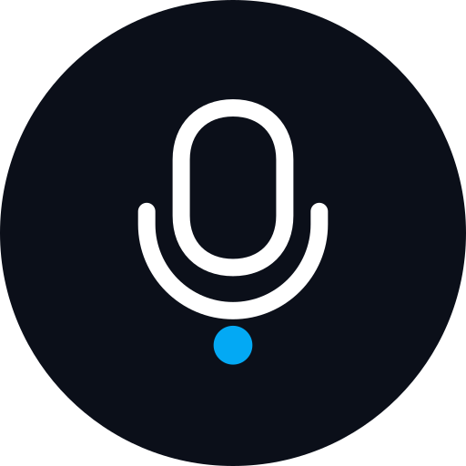
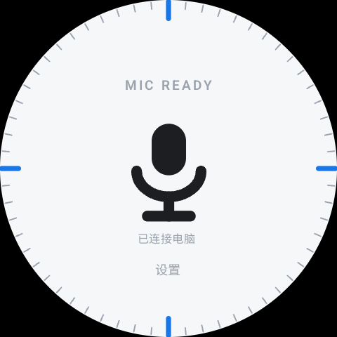
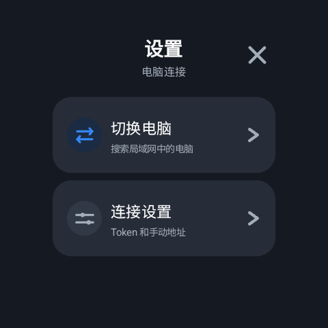

<div align="center">



# SayIt Watch

手表负责录音，电脑负责把话写进当前输入框。

</div>

这不是另一个装在手腕上的 AI 助手。我想要的事情很具体：抬腕说一句，手表把录音通过同一 Wi-Fi 交给电脑；电脑上的 SayIt 完成识别，再沿用原来的 History 和文字插入链路。**输入框里真的出现文字，才算成功。**

<div align="center">


&nbsp;

&nbsp;


<p><em>Galaxy Watch 7 真机画面。Ready 和设置来自本次调试版；录音页沿用已验收的简洁表盘。</em></p>

</div>

## 为什么有这个版本

先把话说清楚：Windows SayIt 不是我从零写的。它来自开源项目 [crosswk/SayIt](https://github.com/crosswk/SayIt)，使用 [AGPL-3.0](LICENSE) 许可证。Windows 客户端、语音识别、History、AI 整理和文字插入能力主要来自原项目及其贡献者；这个仓库在其基础上做了本地安全修复和 Galaxy Watch 7 录音入口，不是上游官方发行版。

平时对着电脑说话，麻烦的常常不是识别，而是麦克风不在手边。拿手机说完再切设备、复制、粘贴，也打断思路。我不想为了省这几步，反而造出一套配对、流式传输和一堆“成功”页面。

> 手表录一句话，通过 Wi-Fi 交给电脑上的 SayIt，然后文字出现在我已经点好的输入框里。

所以手表只做开始、结束和发送一段完整录音；识别、整理和插入仍由电脑完成。手表不会假装知道后面的 ASR 或插入一定成功。

## 怎么用

1. 在可信的同一 Wi-Fi 下运行本仓库的 Windows **Debug** 版接收端，并在手表上配置本机生成的 64 位 Token。Token 只留在自己的设备上，不要提交到仓库或发给别人。
2. 手表进入 Ready 后，先点好电脑上准备输入文字的位置。
3. 点手表中央麦克风开始录音，说完结束；等电脑把文字写入输入框。需要换电脑时，从「设置 → 切换电脑」选择；自动发现不到时才用「连接设置」里的手动地址。

`Galaxy Watch 7 → Wi-Fi → Windows SayIt → 现有 ASR → History → 当前输入框`

本次更新是开发快照，尚未发布对应的新安装包。仓库中的旧便携版不代表本次代码。想从另一台电脑接手，先克隆仓库，再读 [HANDOFF.md](HANDOFF.md) 和 [PROJECT_PROGRESS.md](PROJECT_PROGRESS.md)：

```powershell
git clone https://github.com/Suzixuan/SayIt-Watch.git
cd SayIt-Watch\watch
```

在 Windows 上准备 JDK 17 与 Android SDK 后，在 `watch/` 运行：

```powershell
.\gradlew.bat testDebugUnitTest lintDebug assembleDebug
```

构建出的 Debug APK 在 `watch/app/build/outputs/apk/debug/`。Windows 接收端的调试运行、环境边界和验收证据见交接文档；不要把上游正式安装包当作这个 Watch 版本。

## 现在验证到哪一步

- Galaxy Watch 7 与一台 Windows 电脑的发现、连接，以及录音经电脑识别并写入目标输入框，已有真机和用户实测证据。
- Ready 表盘、设置内切换入口和旧电脑保留已在真机检查。本次将「已连接电脑」做了光学居中微调。
- 台式机与笔记本**同时在线**时的发现、显式切换及换机后录音，尚未完成端到端验收；不能把这部分说成已验证。Windows 接收端目前仍是 Debug 测试链路，不是正式发布包。

更新记录见 [CHANGELOG.md](CHANGELOG.md)。从另一台电脑继续前，先 `git pull --ff-only`；凭证与本机配置需在那台电脑单独设置，不随 Git 同步。
