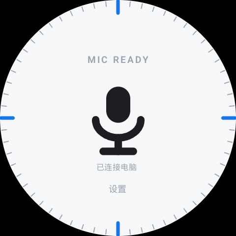
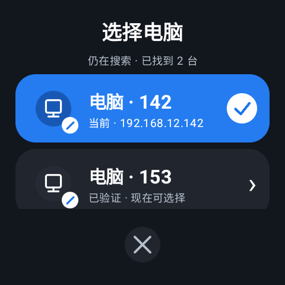
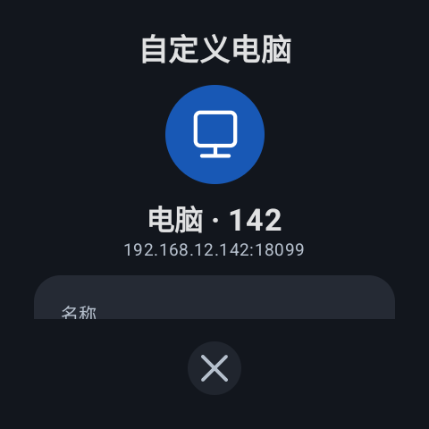
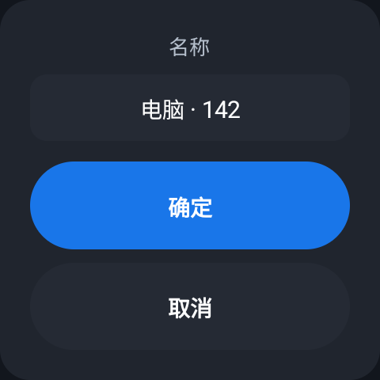
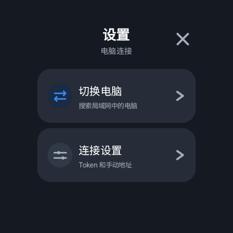
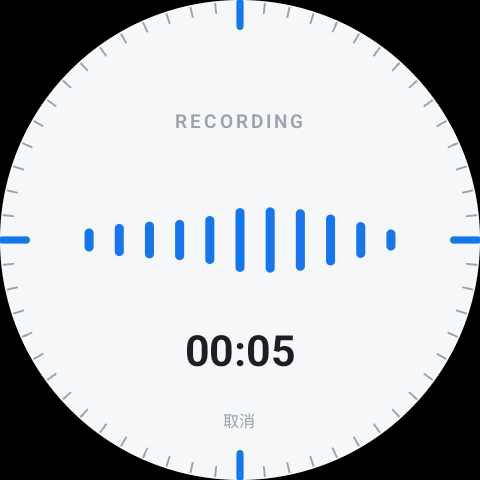
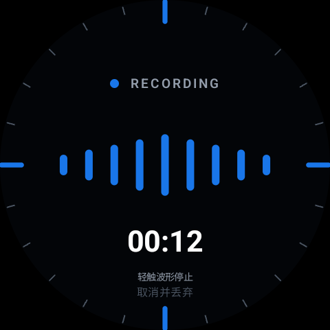
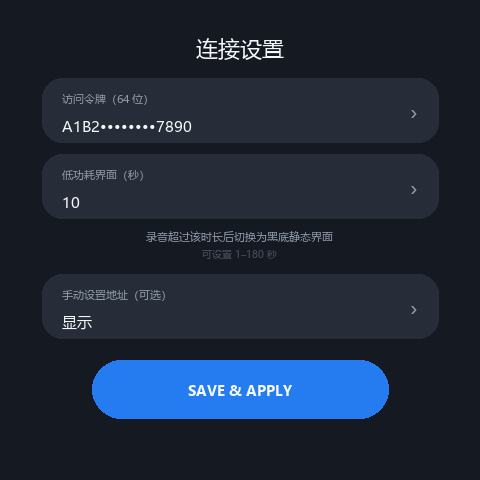

<div align="center">


# SayIt Watch

**抬腕说话，电脑把文字写进当前输入框。**

Wear OS 3+ 手表负责录音和选择电脑；Windows SayIt 继续负责语音识别、AI 整理、History 与文字插入。

当前可下载测试版：**SayIt Watch 0.3.0-dev.16 / code 20**

</div>

## 先安装：从下载到连上电脑

不需要下载源码，也不需要 Android Studio。先从 [GitHub 最新版本](https://github.com/Suzixuan/SayIt-Watch/releases/latest) 下载：

- `SayIt-Watch-0.3.0-dev.16-windows-wear-os-bundle.zip`：首次安装推荐，里面同时有 Windows SayIt、Wear OS APK 和两个安装入口；
- `SayIt-Watch-0.3.0-dev.16.apk`：电脑端已配置好、只想更新手表时使用。

> 这是可信局域网内使用的 **Debug 测试包**，不是正式安全 Release。不要在公共 Wi-Fi 使用，也不要把 Token 发给别人。

### 兼容范围

同一个客户端面向所有满足以下条件的设备，不按品牌拆分 APK：

- Wear OS 3 或更高版本（Android API 30+）；
- 系统向第三方应用开放麦克风；
- 具备 Wi-Fi，能和 Windows 电脑进入同一可信局域网。

因此目标范围包括运行 Wear OS 3+ 的 Samsung Galaxy Watch、Google Pixel Watch，以及 Xiaomi、OnePlus、OPPO、Mobvoi/TicWatch 等品牌的 Wear OS 型号。具体型号仍以真机验证为准；目前完整设备证据来自 Galaxy Watch 7，不能把“同平台可安装”写成“所有型号已经实测”。

当前**不兼容**：Apple Watch、华为/HarmonyOS 手表、Amazfit/Zepp OS、Garmin、旧 Samsung Tizen、Fitbit OS、不能安装第三方应用的 RTOS 手环，以及没有向应用开放麦克风或 Wi-Fi 的型号。`2-Install-Watch.cmd` 会在安装前检查 API 版本、手表类型、麦克风和 Wi-Fi，不符合条件时停止并说明原因。

### 第一步：配置并启动电脑端

1. 把 ZIP **完整解压**到一个普通文件夹，不要直接在压缩包里运行。
2. 双击 `1-Setup-PC.cmd`。
3. 第一次使用时选择电脑的 Wi-Fi 局域网 IP；脚本会生成 Token、写入配置并启动 SayIt。
4. Windows 防火墙询问时，只勾选 **专用网络**。

已有有效配置会保留，不会替换 Token。脚本只接受 `10.x`、`172.16–31.x` 或 `192.168.x` 的明确局域网地址，不会配置 `0.0.0.0`。

### 第二步：把 SayIt 安装到 Wear OS 手表

1. 下载并解压 Google 官方 [Android SDK Platform-Tools](https://developer.android.com/tools/releases/platform-tools)。把解压后的 `platform-tools` 文件夹放进 SayIt 安装包目录。
2. 手表进入「设置 → 关于手表 → 软件信息」，连续点按软件版本直到开发者模式开启。
3. 回到「设置 → 开发者选项」，开启 **ADB 调试**和**无线调试**。
4. 双击电脑上的 `2-Install-Watch.cmd`。
5. 按窗口提示，在手表「无线调试 → 使用配对码配对设备」中读取配对地址和配对码；随后返回上一页读取真正的连接地址。两个端口通常不同。
6. 脚本先确认设备是 API 30+ 的 Android/Wear OS 手表，并具备麦克风和 Wi-Fi；通过后才安装 `SayIt-Watch.apk`。首次安装会把电脑端的同一个 Token 写入手表应用私有配置；升级安装会保留原 Token、电脑名称和设置。

ADB 配对的标准流程可对照 Android 官方的 [Wear OS 无线调试说明](https://developer.android.com/training/wearables/get-started/debug-wifi)。

### 第三步：确认已经连通

1. 保持电脑和手表连接同一个可信 Wi-Fi。
2. 电脑端 SayIt 保持运行；手表打开 SayIt，等待数秒。
3. 手表出现「已连接电脑」后，在 Windows 打开记事本并点进输入框。
4. 手表点麦克风，说一句话后结束；识别完成后，文字应进入刚才选中的输入框。

如果一直没有连上：

- 确认电脑端仍在运行，Windows 网络类型是「专用网络」；
- 确认路由器没有开启 AP/客户端隔离；
- 手表和电脑必须能互相访问，访客 Wi-Fi 通常不行；
- 在手表「连接设置」里检查 Token；自动发现仍失败时再展开手动设置，填写电脑 IP 和端口 `18099`。

第二台电脑也想出现在手表列表时，在第二台运行 `1-Setup-PC.cmd`，按提示安全粘贴第一台电脑的同一个 Token；每台电脑使用各自的局域网 IP。

<div align="center">


&nbsp;

&nbsp;


<p><em>Galaxy Watch 7 真机画面：Ready、双电脑选择与本地自定义。</em></p>

</div>

## 这个项目是什么

Windows SayIt 来自开源项目 [crosswk/SayIt](https://github.com/crosswk/SayIt)，使用 [AGPL-3.0](LICENSE) 许可证。原项目提供 Windows 客户端、语音识别、AI 整理、History 和向当前输入框插入文字等核心能力；本仓库在其基础上保留既有安全修复，并增加通用 Wear OS 3+ 录音入口、局域网发现和多电脑选择。

它不是上游官方发行版，也不是另一个手腕 AI 助手。它只把离手最近的麦克风变成 SayIt 的一个入口：

```text
Wear OS 手表 → 同一可信 Wi-Fi → Windows SayIt
              → 现有 ASR / AI 整理 → History → 当前输入框
```

手表只确认录音已交给电脑，不会把“上传成功”伪装成“文字已经插入”。**目标输入框里真正出现文字，完整链路才算成功。**

## 从最初版本到 dev.16

### 1. 手表录音与完整音频传输

- Wear OS 手表上点麦克风开始录音，结束后发送一段完整 WAV。
- 音频保持 16 kHz、16-bit、单声道；显示时长按实际采样数计算。
- 支持录音取消、上传失败后的保留/重试边界和前台防熄屏。
- Windows 继续使用既有 Provider、ASR、AI、History、Paste 和目标窗口跟踪链路。

### 2. Debug-only 安全接收链

- Watch 使用 Bearer Token 和 requestId 发送音频。
- Token 只保存在用户自己的设备中，不进入 mDNS、截图、日志或 Git。
- 接收端只用于 Debug，绑定明确的 RFC1918 局域网 IPv4；正式 Release 不启用当前明文 HTTP 入口。
- 请求先经过 WAV、认证和接收状态校验，再进入现有桌面处理链；不会因地址重找自动重发同一段音频。

### 3. 自动发现与前台恢复

- Windows Debug 接收端通过标准 DNS-SD/mDNS 广播 `_sayit-watch._tcp`。
- Watch 启动时先短探针检查上次电脑；地址失效时执行最多 8 秒的认证发现。
- 电脑晚启动、应用回到前台或上次 IP 因 DHCP 改变时，可以重新发现并恢复 Ready。
- 路由器隔离 mDNS 或发现失败时，仍保留 Token、手动 IP 和端口兜底。

### 4. 双电脑即时选择

- 「设置 → 切换电脑」同时显示当前电脑和其他已认证电脑。
- 候选电脑完成认证后立即出现在列表中，不必等整个搜索窗口结束。
- 搜索仍继续收集其他电脑；只有用户明确点选后才切换，不按发现顺序猜测。
- 主名称使用可读标签，短 IP 和在线状态作为次要信息；当前电脑用颜色和勾选双重标记。

### 5. 打开页面期间的实时在线列表

- 选择器可见且应用在前台时，连续运行已有的有界认证浏览。
- 新启动的电脑端通过认证后自动加入。
- 非当前电脑若既未被发现、又无法通过确认探针，会在一轮刷新后移除。
- 当前电脑离线时不会突然消失，而是保留并显示「未连接」；恢复后原位回到在线。
- 关闭页面、退到后台、选择电脑、进入录音或销毁 ViewModel 时立即停止刷新，不做常驻高频扫描。

### 6. 电脑本地昵称与圆屏交互

- 每台电脑左侧有铅笔角标；点图标或长按卡片正文进入「自定义电脑」。
- 普通点卡片正文仍然只负责切换电脑，编辑和切换不会抢同一个触控事件。
- 可以保存 1–16 字符本地昵称或恢复 `电脑 · <IP 末段>`。
- 昵称只存于 Watch 私有设置，并按已认证的 `IP:port` 隔离；当前还没有稳定设备 ID，因此 DHCP 改址后不会自动迁移旧昵称。
- 列表和自定义页使用固定的底部居中关闭键，滚动区域在它上方结束，不再被圆屏边缘或按钮遮挡。

### 7. 通用 Wear OS 安装契约

- APK 明确要求 `android.hardware.type.watch`、麦克风和 Wi-Fi；应用商店或安装流程可据此排除不具备核心能力的设备。
- 最低版本保持 API 30，对应本项目的 Wear OS 3+ 支持基线。
- 安装脚本在写入应用或 Token 前完成设备能力检查，连接到普通 Android 手机、旧系统或缺少麦克风/Wi-Fi 的手表时安全停止。
- 客户端不依赖 Samsung SDK；同一 APK 用于不同品牌的 Wear OS 设备。Galaxy Watch 7 仍是当前真机证据，不代表其他品牌已经逐台验收。

### 8. 手表录音也经过 AI 整理

- 手表上传的录音与电脑麦克风录音共用同一套 `AI 整理` 开关，不再被外部入口强制关闭。
- AI 开启时，沿用当前提示词预设、应用规则、热词、语言和最短整理时长；启用上下文感知写作时，也使用同一隐私边界读取目标输入框上下文。
- AI 关闭时仍只做语音识别，不会暗中调用 AI，也不会改写用户保存的设置。

### 9. 可设置的低功耗录音界面

- 在手表「设置 → 连接设置 → 低功耗界面（秒）」设置切换时间，默认 10 秒，可填 1–180 秒。
- 阈值前保持原来的亮色动态波形；到时自动切到黑底静态波形，录音计时仍每秒更新。点波形结束录音，底部「取消并丢弃」放弃本次录音。
- Galaxy Watch 7 初测显示 30 秒内渲染帧数从 1815 降到 632；两组 165 秒电量计都显示 3.692 mAh，尚不能据此断言续航提升。实际续航需要长期观察。

## 当前界面

<div align="center">


&nbsp;

&nbsp;


<p><em>录音页、名称编辑页和设置入口。</em></p>

</div>

<div align="center">


&nbsp;

&nbsp;


<p><em>dev.16：真机录音前后界面与连接设置示意图。</em></p>

</div>

## 日常使用

- Windows SayIt 保持运行，手表和电脑保持在同一可信 Wi-Fi。
- 先在电脑点好目标输入框，再从手表录音；结束后等待文字写入。
- 多台电脑时进入「设置 → 切换电脑」：点卡片切换，点铅笔或长按卡片修改本地名称。
- 电脑关闭后会从可选列表移除；重新启动并通过认证后会重新出现。当前电脑离线时会保留并显示「未连接」。

## 最新验证状态

已验证：

- Galaxy Watch 7 单电脑自动发现、认证、前台恢复和 Ready 显示。
- 一段真实 Watch WAV 进入 Windows 现有识别链并写入目标输入框。
- 同一段真实 Watch WAV 经 dev.15 新 EXE 重放后实际调用 AI：History 中 `llmMs > 0` 且整理结果不同于 ASR 原文。
- Galaxy Watch 7 现场录音经 Wi-Fi 上传到 dev.15 Windows 后，真实完成 ASR、DeepSeek AI 整理并写入 History；手表正常返回 Ready。
- dev.16 在 Galaxy Watch 7 上保留数据升级；10 秒阈值前后界面、设置保存与重启持久化、取消返回 Ready 已实测。Watch 258 项单测、lint、Debug/Release 构建通过。
- 两台电脑同时在线时即时出现、显式 `.142 → .153 → .142` 切换。
- dev.13 真机图标点按进入当前电脑自定义页。
- dev.13 真机长按另一台电脑进入正确自定义页，且不会误切当前目标。
- 名称字段能打开编辑界面与三星输入法；列表和自定义页的底部关闭键不遮挡内容。
- Watch 自动化：30 suites / 258 tests / 0 failures / 0 errors；lint 0 error。
- Windows 前端自动化：31 test files / 371 tests / 0 failures；TypeScript/Vite 构建通过。
- 通用 Wear OS 3+ 能力门槛已通过源码和构建验证；Watch 外部录音的 AI 开关与提示词路由已有回归测试。

仍待完成：

- 至少一台非 Samsung Wear OS 3+ 真机的安装、录音、自动发现和文字写入验收。
- 用三星 T9 手动输入真实昵称后，确认保存、列表即时更新和恢复默认的完整手动体验。
- 真实关闭/重开第二台 Windows 软件，确认选择器中的自动消失/重新出现时序。
- 两台电脑各完成一条真实录音路由，以及后续重复/连续运行验收。
- 正式发布链路；当前 Watch HTTP 接收/发送能力仍是 Debug-only。
- 低功耗界面对实际续航的影响需要长期观察；本轮电量计分辨率不足以测出差异。

详细证据和未完成项见 [HANDOFF.md](HANDOFF.md)、[PROJECT_PROGRESS.md](PROJECT_PROGRESS.md) 与 [dev.13 真机证据](docs/evidence/1C-PM-UI-02-R5/README.md)。

## 从源码继续

```powershell
git clone https://github.com/Suzixuan/SayIt-Watch.git
cd SayIt-Watch
```

开始前先读：

- [AGENTS.md](AGENTS.md)：项目硬边界与验证要求
- [HANDOFF.md](HANDOFF.md)：当前实现、设备证据和下一步
- [PROJECT_PROGRESS.md](PROJECT_PROGRESS.md)：唯一权威进度表

Watch 构建需要 JDK 17 和 Android SDK：

```powershell
cd watch
.\gradlew.bat testDebugUnitTest --rerun-tasks lintDebug assembleDebug
```

Debug APK 会生成在 `watch/app/build/outputs/apk/debug/`，但 `*.apk` 已被忽略，不进入 Git 历史。凭证、`local.properties`、设备序列号、录音、模型、安装包和构建缓存都必须留在本机。

GitHub Release 提供的是 Debug 测试包；正式安全 Release、签名安装器和自动更新渠道仍未完成。

## 许可证与来源

- 上游：[crosswk/SayIt](https://github.com/crosswk/SayIt)
- 许可证：[GNU Affero General Public License v3.0](LICENSE)
- 本仓库不是上游官方发行版

更新记录见 [CHANGELOG.md](CHANGELOG.md)。在另一台电脑继续前使用 `git pull --ff-only`；Token 和本机配置需要重新设置，不随 Git 同步。
